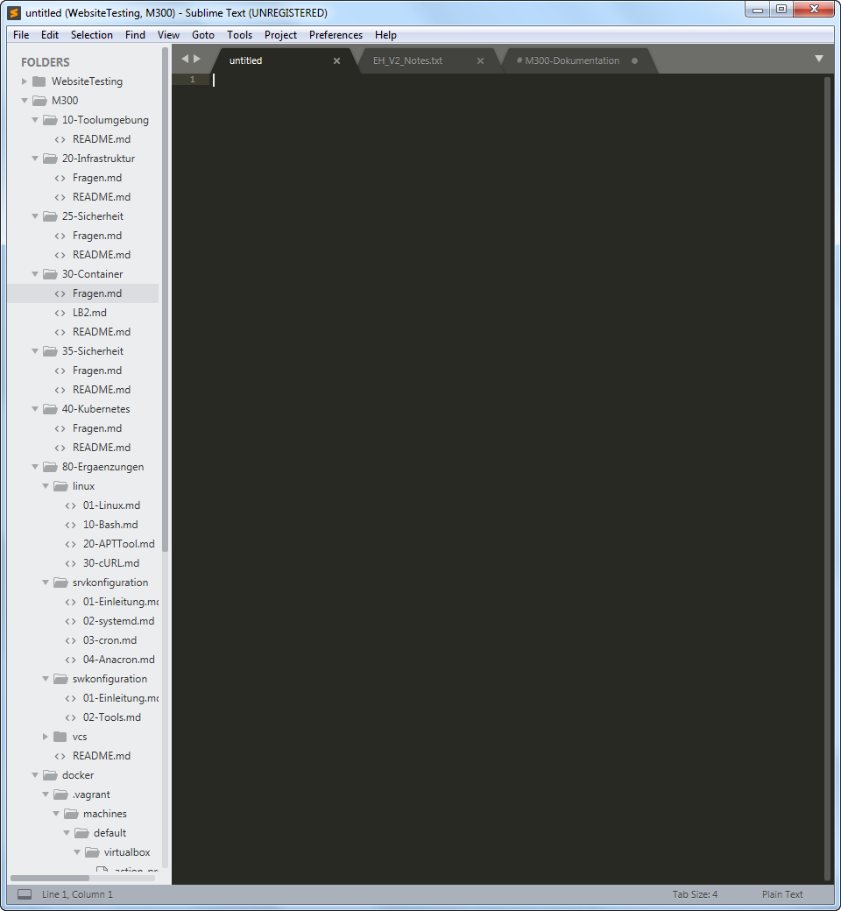

# M300-Dokumentation
============
### Verzeichnis
* [LB1]
* [LB2]
* [LB3]
***
LB1
============
***
LB2
============
K1
* Virtualbox

* Vagrant

* Sublime

* Git-Client

K2
* [GitHub-Account ist erstellt](https://github.com/ViV0rtex/)
* Git-Client wurde verwendet (Bild)

* [Dokumentation ist als Mark Down vorhanden](https://github.com/ViV0rtex/M300-Services/blob/master/README.md)
* SUblime - Mark Down Editor ausgewählt und eingerichtet
* Wichtige Lernschritte sind dokumentiert
K3
* Bestehende VM aus Vagrant-Cloud einrichten
* 
K4
K5

***
LB3
============
