# M300-Dokumentation
### Verzeichnis
* [LB1]
* [LB2]
* [LB3]
***
LB1
============
***
LB2
============
K1
* Virtualbox
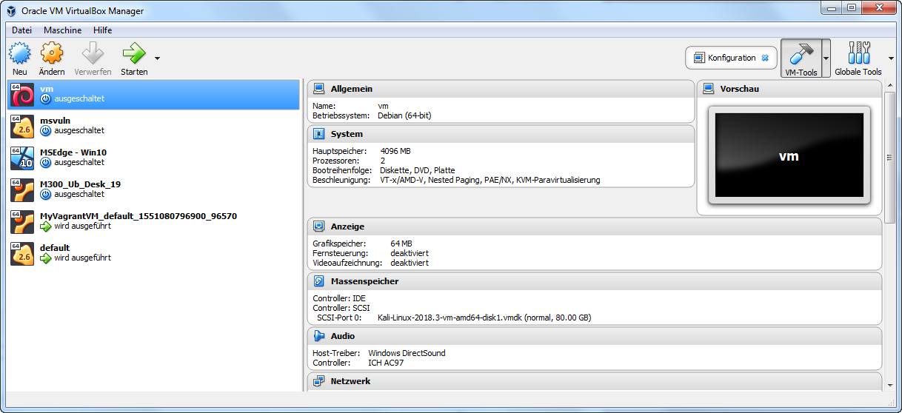
* Vagrant

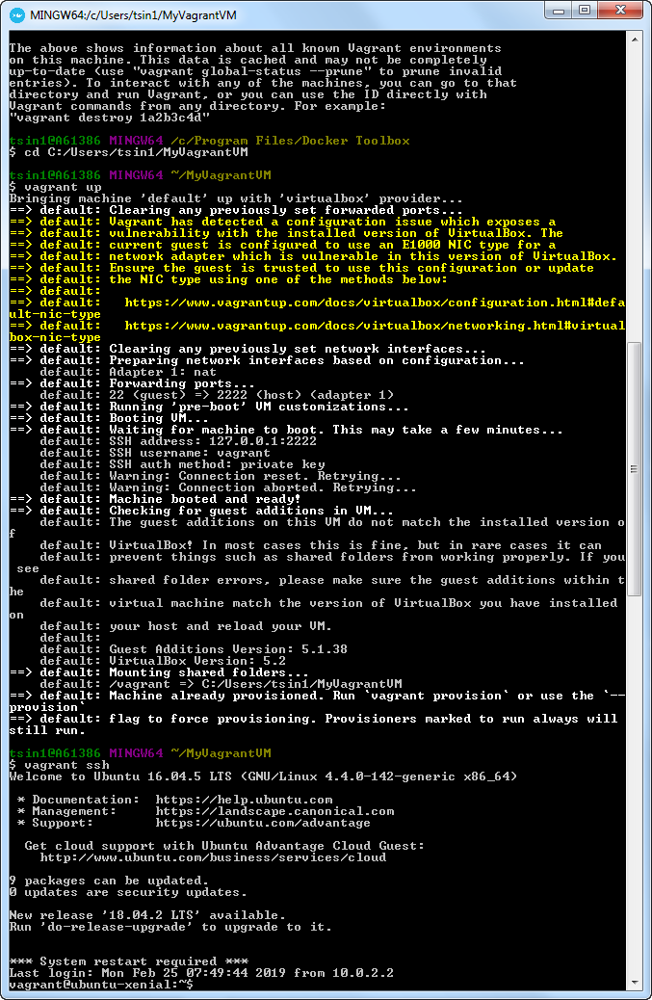
* Sublime

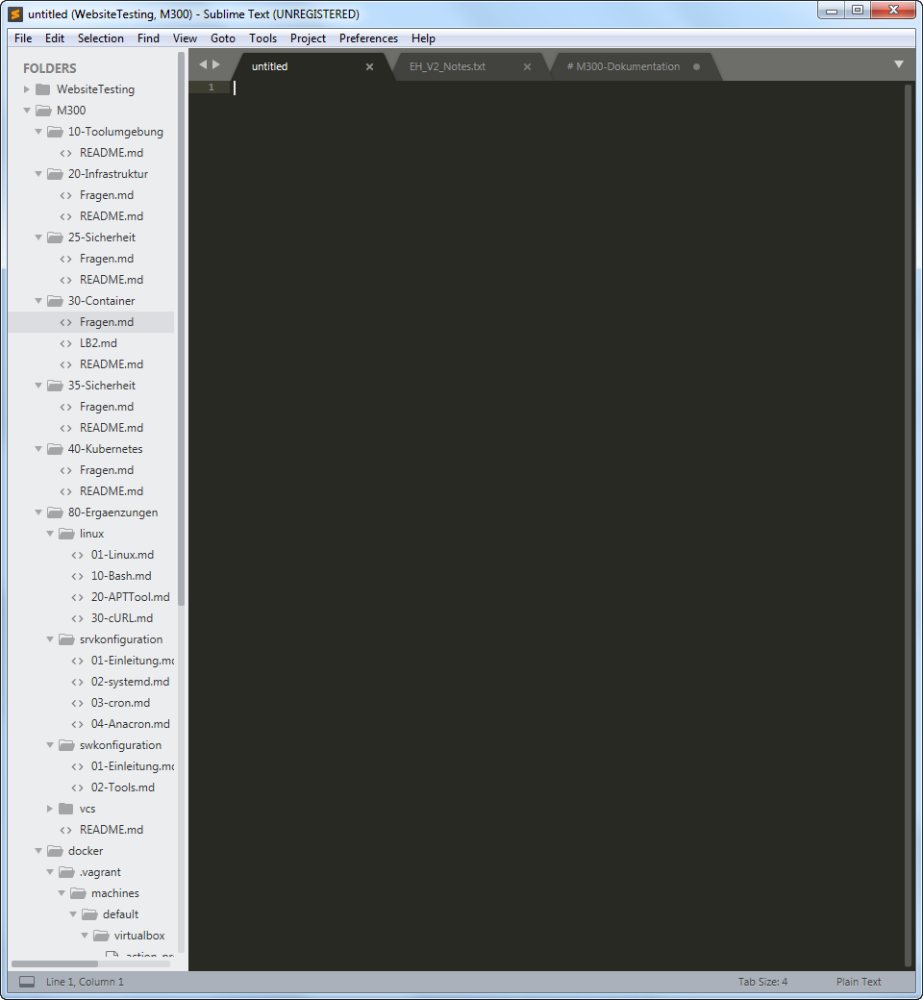
* Git-Client

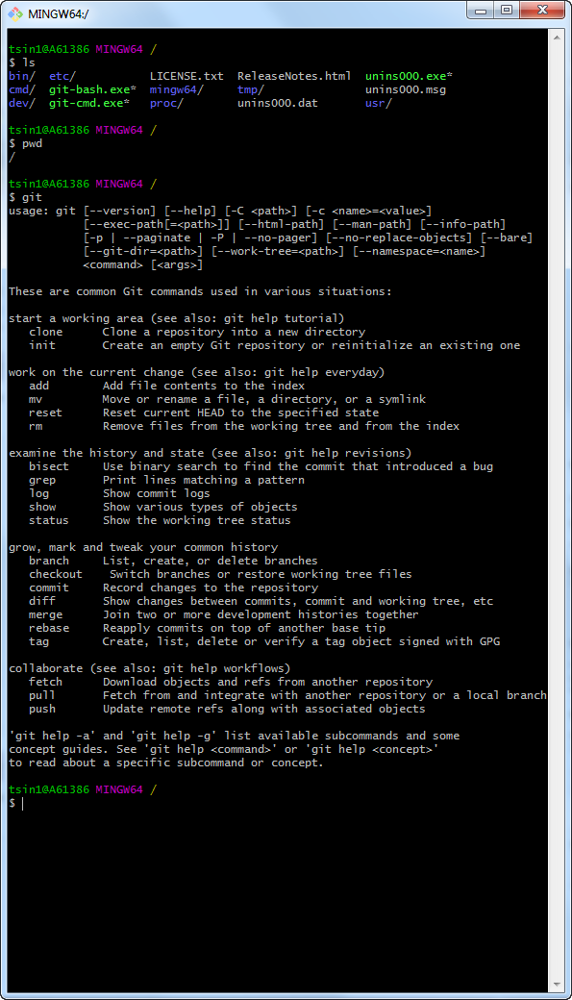

K2
* [GitHub-Account ist erstellt](https://github.com/ViV0rtex/)
* Git-Client wurde verwendet 

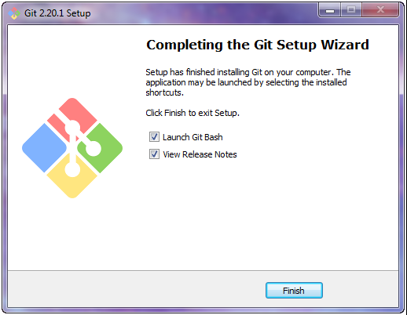
* [Dokumentation ist als Mark Down vorhanden](https://github.com/ViV0rtex/M300-Services/blob/master/README.md)
* [Sublime - Mark Down Editor ausgewählt und eingerichtet](https://www.sublimetext.com/3)

* Wichtige Lernschritte sind dokumentiert

K3
* Bestehende VM aus Vagrant-Cloud einrichten
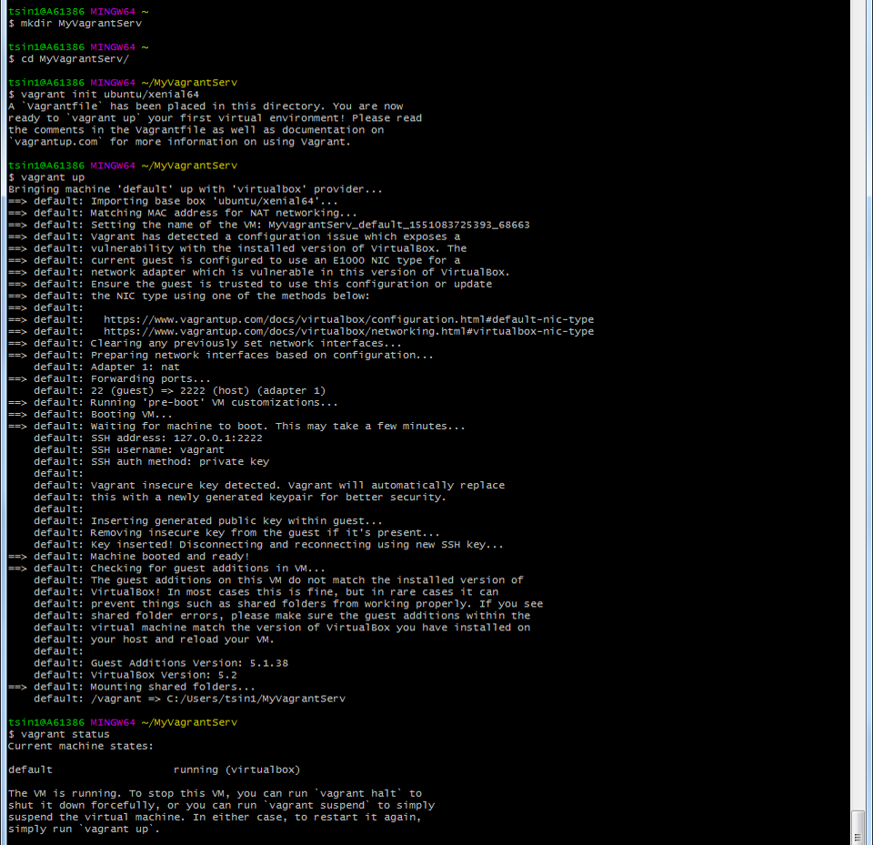
* Kennt die Vagrant-Befehle

| Befehl          | Erklärung                                                                   |
|-----------------|-----------------------------------------------------------------------------|
| vagrant init    | Initialisiert eine neue Vagrant-Umgebung, indem es ein Vagrantfile erstellt |
| vagrant up      | Startet und Provisioniert die Vagrant Umgebung anhand vom Vagrantfile       |
| vagrant ssh     | Verbindet zu der Maschine via SSH                                           |
| vagrant status  | Zeigt den Status der Vagrant Maschine an                                    |
| vagrant destroy | Stoppt und Löscht die Vagrant Maschine                                      |
| vagrant box     | Verwaltet Boxen (Installation, Löschung)                                    |
| vagrant login   | Bei Vagrant mit dem Account anmelden                                        |
| vagrant halt    | Stoppt die Vagrant Maschine                                                 |
| vagrant resume  | Fortsetzen einer Maschine mit dem "suspended" status                        |
| vagrant suspend | Vorübergehendes aussetzen einer Maschine                                    |
| vagrant version | Gibt die Aktuelle und letzte Vagrant Version aus                            |
| vagrant reload  | Startet die Vagrant Maschine neu und lädt das neue Vagrantfile              |

* Eingerichtete Umgebung ist dokumentiert (Umgebungsvariablen, Netzwerkplan gezeichnet, Sicherheitsaspekte)
Siehe fortlaufende Dokumentation
* Funktionsweise getestet inkl. Dokumentation der Testfälle
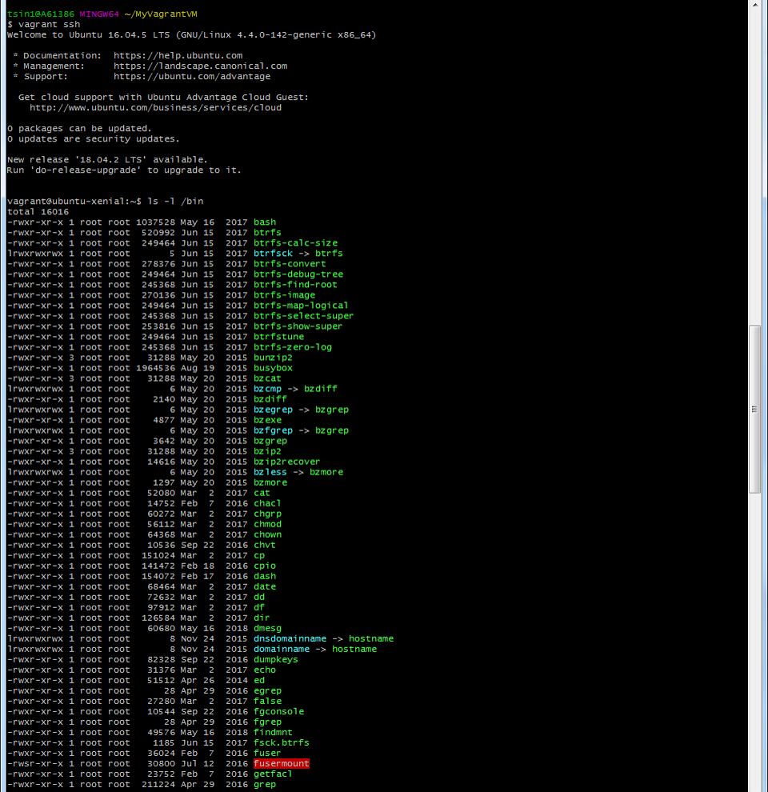
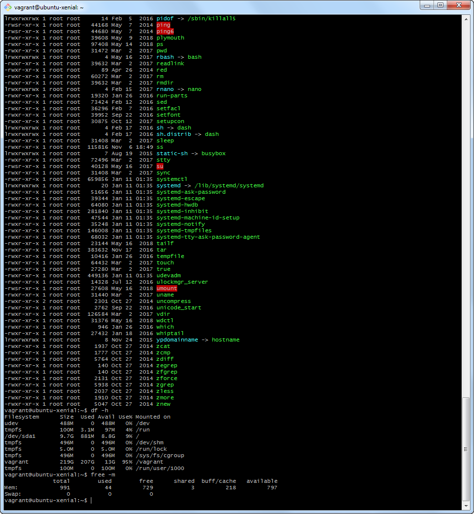
* andere, vorgefertigte vm auf eigenem Notebook aufgesetzt
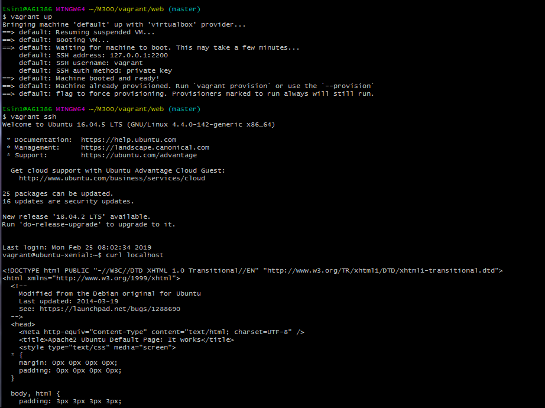

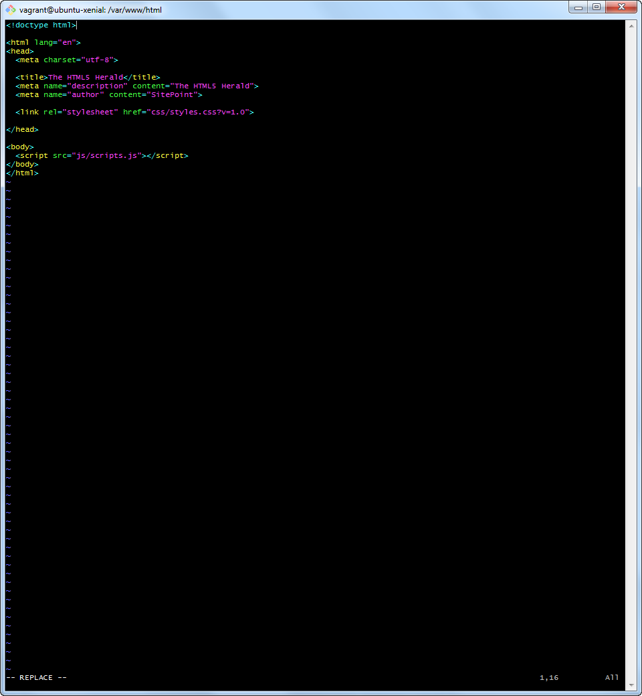
K4
* Firewall eingerichtet ink. Regeln
* Benutzer und Rechtevergabe ist eingerichtet
* Zugang mit SSH-Tunnel abgesichert
* Sicherheitsmassnahmen sidn dokumentiert
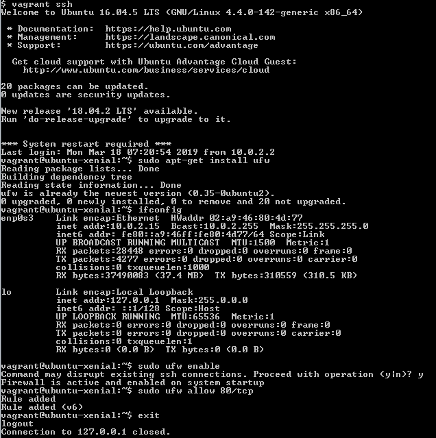

K5 
* Kreativität
* Komplexität
* Umfang

Umsetzung eigener Ideen
* Cloud Integration
* Übungsdokumentation als Vorlage für Modul-Unterlagen erstellt

Persönliche Lernentwicklung
* Vergleich Vorwissen - Wissenzuwachs
Ich kannte bereits viele Linux Befehle, aber mit der Docker/Vagrant und Git Umgebungen zu arbeiten wahr für mich eine neue und lehrreiche Erfahrung. Ich habe gelernt wie nützlich die Provisionierung sein kann, bei der Automatisierung und Änderung von VMs. Ausserdem habe ich nie zuvor mit Markdown gearbeitet und konnte daher auch einiges Lernen, ich hätte gedacht es wäre viel schwieriger aber mit ein wenig Übung kann man es auf einem dezenten Niveau beherrschen.
* Reflexion
Wenn ich dieses Projekt noch einmal durchführen müsste hätte ich dies von einem Linux OS aus gemacht, da dies weniger aufwand betreibt um die Umgebung zum laufen zu bekommen oder zumindest eine neuere Version von Windows als W7. Ansonsten denke ich ist es relativ gut gelaufen und daher habe ich auch keine grösseren Verbesserungsvorschläge(Alles ausser die Installation der Umgebung verlief nach Plan). 

***
LB3
============
